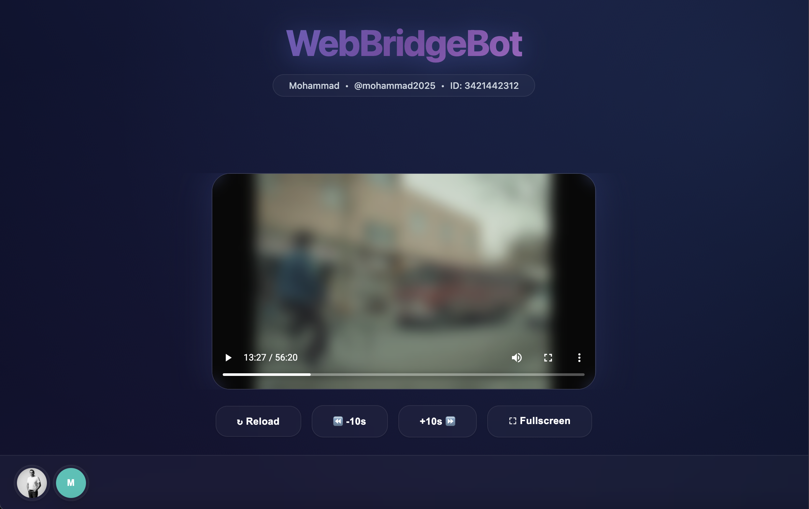

# WebBridgeBot

WebBridgeBot is a Telegram bot that acts as a bridge between Telegram and your web browser. It allows you to forward any video, audio, or photo file to the bot and instantly receive a private link. This link opens a web-based media player that streams the content directly from the bot, enabling seamless playback on devices like TVs, game consoles, or any modern web browser.

<p align="center">
  
</p>

---

### ✨ Features

#### 🎬 Media & Streaming
- **Universal Media Support:** Stream videos, audio files, and photos directly from Telegram to any web browser
- **HTTP Range Requests:** Full support for partial content streaming, enabling smooth seeking in videos and audio
- **Intelligent Binary Cache:** LRU-based disk caching system that stores frequently accessed file chunks for instant replay
- **Audio Visualization:** Beautiful real-time audio spectrum analyzer using AudioMotion for an immersive listening experience
- **High-Quality Playback:** Native HTML5 media players with full browser controls and keyboard shortcuts

#### ⚡ Real-Time Communication
- **WebSocket Integration:** Instant bidirectional communication between Telegram bot and web player
- **Remote Control:** Control playback directly from Telegram using inline buttons (play/pause, seek ±10s, restart, fullscreen)
- **Live Status Updates:** Real-time connection status and playback state notifications
- **Instant Media Loading:** Media appears in the web player immediately when sent to the bot

#### 🔒 Security & Access Control
- **Robust Authorization System:** First user automatically becomes admin with full control privileges
- **Granular Permissions:** Admins can authorize users, grant admin rights, or revoke access at any time
- **Secure URL Generation:** Hash-based authentication ensures media URLs cannot be guessed or shared
- **Session Persistence:** SQLite-based secure session storage with graceful shutdown handling

#### 👨‍💼 Admin Features
- **User Management Commands:** `/authorize`, `/deauthorize`, `/listusers`, `/userinfo`
- **Admin Notifications:** Automatic alerts when new users request access with one-click authorization buttons
- **Media Surveillance:** Optional forwarding of all media to a private log channel with user attribution
- **Paginated User Lists:** Efficiently browse through all users with detailed status information

#### 🎨 Modern Web Interface
- **Gorgeous Dark Theme:** Glassmorphism design with gradient accents and smooth animations
- **Fully Responsive:** Works flawlessly on desktops, tablets, smartphones, smart TVs, and game consoles
- **Profile Avatars:** Display user profile photos fetched directly from Telegram
- **Recent Users Bar:** Quick-switch between multiple user sessions with localStorage-based history
- **Accessibility:** Full keyboard navigation, ARIA labels, and reduced motion support

#### 🚀 Performance & Reliability
- **Asynchronous Operations:** Background metadata saving with debouncing to minimize disk I/O
- **Efficient Memory Usage:** Fixed-size chunk architecture with LRU eviction for optimal cache management
- **Graceful Error Handling:** Comprehensive error recovery with user-friendly status messages
- **Docker Ready:** Full containerization support with Docker Compose for easy deployment
- **Cross-Platform:** Written in Go for excellent performance across all operating systems

### 🛠️ Technologies

- **Backend:** Go 1.21+ with Gorilla Mux for routing and WebSockets
- **Telegram API:** gotgproto (TDLib wrapper) for full MTProto support
- **Database:** SQLite for user management and session storage
- **Caching:** Custom binary cache with LRU eviction and asynchronous persistence
- **Frontend:** Vanilla JavaScript with HTML5 media APIs and CSS3 animations
- **Audio Visualization:** AudioMotion Analyzer for real-time spectrum display
- **Configuration:** Viper + Cobra for flexible config management (env, flags, files)
- **Containerization:** Docker & Docker Compose for simplified deployment

### ⚙️ How It Works

1.  **Send Media:** You forward or upload a media file (video, audio, photo) to the bot in a private chat.
2.  **Generate Link:** The bot processes the file, generates a unique, secure URL, and sends it back to you with a control panel.
3.  **Open Player:** You open the URL in any browser. The web page establishes a WebSocket connection back to the bot.
4.  **Play Media:** The bot sends media information (like filename and type) to the player via WebSocket. The player then starts streaming the file content directly from the bot's server.

### 📋 Prerequisites

- **Docker & Docker Compose:** Required for the recommended containerized deployment.
- **Go (1.21+):** Needed only if you plan to build the application from source manually.
- **Telegram API Credentials:**
    - `API ID` and `API Hash`: Obtain these from [my.telegram.org](https://my.telegram.org/).
    - `Bot Token`: Create a bot and get the token from [@BotFather](https://t.me/BotFather) on Telegram.
- **(Optional) A Telegram Channel for Logging:** If you want to use the surveillance feature, create a private or public channel where the bot will forward all media. The bot must be added to the channel as an administrator with permission to post messages.

### 🔑 User & Admin Management

The bot includes a secure authentication system to control access.

-   **First Admin:** The very first user to interact with the bot (by sending `/start`) is automatically granted admin privileges.
-   **Admin Powers:** Admins receive notifications for new users and can manage access with the following commands.
-   **Authorization:** All subsequent users must be manually authorized by an admin before they can use the bot. Unauthorized users will be prompted to request access.

#### Admin Commands

-   `/authorize <user_id>`: Authorizes a user to use the bot.
-   `/authorize <user_id> admin`: Authorizes a user and grants them admin privileges.
-   `/deauthorize <user_id>`: Revokes a user's access to the bot.
-   `/listusers`: Displays a paginated list of all users and their status.
-   `/userinfo <user_id>`: Shows detailed information for a specific user.

### 🚀 Setup & Deployment (Recommended)

Using Docker Compose is the easiest way to run WebBridgeBot.

**1. Clone the Repository**

```bash
git clone https://github.com/mshafiee/webbridgebot.git
cd webbridgebot
```

**2. Create a `.env` file**

Create a file named `.env` in the project's root directory and paste the following content. Replace the placeholder values with your actual credentials.

```plaintext
# .env - Telegram API Configuration
API_ID=1234567
API_HASH=a1b2c3d4e5f6a1b2c3d4e5f6a1b2c3d4
BOT_TOKEN=1234567890:ABC-DEF1234ghIkl-zyx57W2v1u123ew11

# Web Server and URL Configuration
# Replace localhost with your server's IP or domain name if it's publicly accessible
BASE_URL=http://localhost:8080
PORT=8080

# (Optional) Cache Configuration
HASH_LENGTH=8
MAX_CACHE_SIZE=10737418240 # 10 GB in bytes
CACHE_DIRECTORY=.cache

# (Optional) Admin Surveillance Channel
# The ID of the channel where all media will be forwarded. The bot MUST be an admin in this channel.
# For public channels, it's @channel_username. For private channels, it's usually a large negative number.
# You can find the ID by forwarding a message from the channel to a bot like @userinfobot.
# Example: LOG_CHANNEL_ID=-1001234567890
LOG_CHANNEL_ID=0
```

**3. Run with Docker Compose**

Start the bot in the background:

```bash
docker-compose up -d
```

-   **View logs:** `docker-compose logs -f`
-   **Stop the bot:** `docker-compose down`

### 🔧 Environment Variables

These variables can be set in the `.env` file or directly in your environment.

| Variable          | Description                                                    | Default           | Required |
| ----------------- | -------------------------------------------------------------- | ----------------- | -------- |
| `API_ID`          | Your Telegram API ID.                                          | -                 | **Yes**  |
| `API_HASH`        | Your Telegram API Hash.                                        | -                 | **Yes**  |
| `BOT_TOKEN`       | The token for your Telegram bot.                               | -                 | **Yes**  |
| `BASE_URL`        | The public URL where the bot's web player will be hosted.      | `http://localhost:8080` | **Yes**  |
| `PORT`            | The port on which the web server will run.                     | `8080`            | No       |
| `HASH_LENGTH`     | The length of the short hash used in media URLs.               | `8`               | No       |
| `MAX_CACHE_SIZE`  | Maximum size for the disk cache in bytes.                      | `10737418240` (10GB) | No       |
| `CACHE_DIRECTORY` | The directory to store cached media chunks and the database.   | `.cache`          | No       |
| `DEBUG_MODE`      | Set to `true` to enable verbose logging.                       | `false`           | No       |
| `LOG_CHANNEL_ID`  | Optional ID of a channel to forward all media for logging. The bot must be an admin there. | `0` (disabled)      | No       |

### 🤝 Contributing

We welcome contributions! Please feel free to fork the repository, create a feature branch, and submit a pull request. Check the issues tab for ideas on how to help.

### 📄 License

WebBridgeBot is licensed under the **GNU General Public License v3.0**. See the `LICENSE` file for more details.

### 🛠️ Troubleshooting

-   **Check Environment Variables:** Ensure all required variables (`API_ID`, `API_HASH`, `BOT_TOKEN`, `BASE_URL`) are correctly set in your `.env` file.
-   **Review Logs:** Use `docker-compose logs -f` to check for any errors during startup or operation.
-   **Permissions:** Make sure the `.cache` directory has the correct write permissions for the Docker container. Docker Compose handles this with volumes, but it's a common issue in other setups.
-   **Forwarding to Log Channel Fails:** Ensure the `LOG_CHANNEL_ID` is correct and that the bot has been added as an administrator to the channel with permission to post messages.

---

## نسخه فارسی (Persian Version)

# WebBridgeBot

پروژه WebBridgeBot یک ربات تلگرامی است که به عنوان پلی بین تلگرام و مرورگر وب شما عمل می‌کند. این ربات به شما امکان می‌دهد هر فایل ویدیویی، صوتی یا تصویری را به آن ارسال کرده و فوراً یک لینک خصوصی دریافت کنید. این لینک یک پخش‌کننده رسانه مبتنی بر وب را باز می‌کند که محتوا را مستقیماً از ربات استریم کرده و امکان پخش یکپارچه بر روی دستگاه‌هایی مانند تلویزیون، کنسول‌های بازی یا هر مرورگر وب مدرنی را فراهم می‌کند.

<p align="center">
  
</p>

---

### ✨ ویژگی‌ها

#### 🎬 رسانه و استریمینگ
- **پشتیبانی جامع از رسانه:** پخش مستقیم ویدیو، فایل‌های صوتی و تصاویر از تلگرام به هر مرورگر وب
- **درخواست‌های محدوده HTTP:** پشتیبانی کامل از استریمینگ محتوای جزئی، امکان جابجایی روان در ویدیوها و صوت‌ها
- **کش باینری هوشمند:** سیستم کش دیسک مبتنی بر LRU که تکه‌های فایل‌های پرکاربرد را برای پخش فوری ذخیره می‌کند
- **ویژوالایزر صوتی:** آنالایزر طیف صوتی زیبا و لحظه‌ای با استفاده از AudioMotion برای تجربه‌ای غرق‌کننده
- **پخش با کیفیت بالا:** پخش‌کننده‌های رسانه HTML5 بومی با کنترل‌های کامل مرورگر و میانبرهای صفحه‌کلید

#### ⚡ ارتباط لحظه‌ای
- **یکپارچگی وب‌سوکت:** ارتباط دوطرفه فوری بین ربات تلگرام و پخش‌کننده وب
- **کنترل از راه دور:** کنترل پخش مستقیماً از تلگرام با استفاده از دکمه‌های درون‌خطی (پخش/توقف، جابجایی ±۱۰ ثانیه، شروع مجدد، تمام‌صفحه)
- **به‌روزرسانی وضعیت زنده:** اعلان‌های لحظه‌ای وضعیت اتصال و حالت پخش
- **بارگذاری فوری رسانه:** رسانه بلافاصله پس از ارسال به ربات در پخش‌کننده وب ظاهر می‌شود

#### 🔒 امنیت و کنترل دسترسی
- **سیستم مجوزدهی قوی:** اولین کاربر به طور خودکار ادمین می‌شود با تمام اختیارات کنترلی
- **مجوزهای دقیق:** ادمین‌ها می‌توانند کاربران را مجاز کنند، حق ادمین بدهند یا دسترسی را لغو کنند
- **تولید URL امن:** احراز هویت مبتنی بر هش تضمین می‌کند URL های رسانه قابل حدس زدن یا اشتراک‌گذاری نیستند
- **ماندگاری نشست:** ذخیره‌سازی امن نشست مبتنی بر SQLite با مدیریت خاموش شدن ایمن

#### 👨‍💼 ویژگی‌های ادمین
- **دستورات مدیریت کاربر:** `/authorize`، `/deauthorize`، `/listusers`، `/userinfo`
- **اعلان‌های ادمین:** هشدارهای خودکار هنگامی که کاربران جدید درخواست دسترسی می‌کنند با دکمه‌های تأیید یک‌کلیکی
- **نظارت رسانه:** فوروارد اختیاری تمام رسانه‌ها به کانال لاگ خصوصی با نسبت دادن کاربر
- **لیست‌های کاربر صفحه‌بندی شده:** مرور کارآمد تمام کاربران با اطلاعات دقیق وضعیت

#### 🎨 رابط وب مدرن
- **تم تاریک زیبا:** طراحی گلس‌مورفیسم با لهجه‌های گرادیانت و انیمیشن‌های روان
- **کاملاً واکنش‌گرا:** بدون مشکل روی دسکتاپ، تبلت، گوشی‌های هوشمند، تلویزیون‌های هوشمند و کنسول‌های بازی کار می‌کند
- **آواتار پروفایل:** نمایش عکس‌های پروفایل کاربر که مستقیماً از تلگرام دریافت می‌شوند
- **نوار کاربران اخیر:** جابجایی سریع بین نشست‌های کاربری متعدد با تاریخچه مبتنی بر localStorage
- **دسترس‌پذیری:** ناوبری کامل صفحه‌کلید، برچسب‌های ARIA و پشتیبانی از حرکت کاهش‌یافته

#### 🚀 عملکرد و قابلیت اطمینان
- **عملیات ناهمزمان:** ذخیره‌سازی متادیتا در پس‌زمینه با debouncing برای به حداقل رساندن I/O دیسک
- **استفاده بهینه از حافظه:** معماری تکه با اندازه ثابت با حذف LRU برای مدیریت بهینه کش
- **مدیریت خطای ایمن:** بازیابی جامع خطا با پیام‌های وضعیت کاربرپسند
- **آماده Docker:** پشتیبانی کامل از کانتینری‌سازی با Docker Compose برای استقرار آسان
- **چندسکویی:** نوشته شده در Go برای عملکرد عالی در تمام سیستم‌عامل‌ها

### 🛠️ فناوری‌ها

- **بک‌اند:** Go نسخه 1.21+ با Gorilla Mux برای مسیریابی و وب‌سوکت
- **API تلگرام:** gotgproto (wrapper برای TDLib) با پشتیبانی کامل MTProto
- **پایگاه داده:** SQLite برای مدیریت کاربر و ذخیره‌سازی نشست
- **کش:** کش باینری سفارشی با حذف LRU و پایداری ناهمزمان
- **فرانت‌اند:** JavaScript خالص با APIهای رسانه HTML5 و انیمیشن‌های CSS3
- **ویژوالایزر صوتی:** AudioMotion Analyzer برای نمایش طیف لحظه‌ای
- **پیکربندی:** Viper + Cobra برای مدیریت انعطاف‌پذیر پیکربندی (env، flags، files)
- **کانتینری‌سازی:** Docker و Docker Compose برای استقرار ساده‌شده

### ⚙️ نحوه کار

1.  **ارسال رسانه:** شما یک فایل رسانه (ویدیو، صوت، عکس) را به ربات در یک چت خصوصی ارسال یا فوروارد می‌کنید.
2.  **ایجاد لینک:** ربات فایل را پردازش کرده، یک URL منحصربه‌فرد و امن ایجاد می‌کند و آن را به همراه یک پنل کنترل برای شما ارسال می‌کند.
3.  **باز کردن پخش‌کننده:** شما URL را در هر مرورگری باز می‌کنید. صفحه وب یک اتصال وب‌سوکت به ربات برقرار می‌کند.
4.  **پخش رسانه:** ربات اطلاعات رسانه (مانند نام فایل و نوع) را از طریق وب‌سوکت به پخش‌کننده ارسال می‌کند. سپس پخش‌کننده شروع به استریم محتوای فایل مستقیماً از سرور ربات می‌کند.

### 📋 پیش‌نیازها

- **داکر و داکر کامپوز (Docker & Docker Compose):** برای راه‌اندازی پیشنهادی به صورت کانتینری مورد نیاز است.
- **زبان Go (نسخه 1.21 به بالا):** تنها در صورتی که قصد دارید برنامه را به صورت دستی از سورس کامپایل کنید، لازم است.
- **اطلاعات API تلگرام:**
    - `API ID` و `API Hash`: این مقادیر را از [my.telegram.org](https://my.telegram.org/) دریافت کنید.
    - `توکن ربات (Bot Token)`: یک ربات جدید در [@BotFather](https://t.me/BotFather) در تلگرام ایجاد کرده و توکن آن را دریافت کنید.
- **(اختیاری) یک کانال تلگرام برای لاگ:** اگر می‌خواهید از قابلیت نظارت استفاده کنید، یک کانال عمومی یا خصوصی ایجاد کنید تا ربات تمام رسانه‌ها را به آنجا فوروارد کند. ربات باید به عنوان ادمین با دسترسی ارسال پیام به کانال اضافه شود.

### 🔑 مدیریت کاربران و ادمین

این ربات شامل یک سیستم احراز هویت امن برای کنترل دسترسی است.

-   **اولین ادمین:** اولین کاربری که با ربات تعامل می‌کند (با ارسال دستور `/start`) به طور خودکار اختیارات ادمین را دریافت می‌کند.
-   **اختیارات ادمین:** ادمین‌ها اعلان‌هایی برای کاربران جدید دریافت کرده و می‌توانند با دستورات زیر دسترسی‌ها را مدیریت کنند.
-   **مجوزدهی:** تمام کاربران بعدی باید به صورت دستی توسط یک ادمین تأیید شوند تا بتوانند از ربات استفاده کنند. از کاربران غیرمجاز خواسته می‌شود تا درخواست دسترسی دهند.

#### دستورات ادمین

-   `/authorize <user_id>`: به یک کاربر مجوز استفاده از ربات را می‌دهد.
-   `/authorize <user_id> admin`: به یک کاربر مجوز استفاده داده و او را به سطح ادمین ارتقا می‌دهد.
-   `/deauthorize <user_id>`: دسترسی یک کاربر به ربات را لغو می‌کند.
-   `/listusers`: لیستی صفحه‌بندی شده از تمام کاربران و وضعیت آن‌ها را نمایش می‌دهد.
-   `/userinfo <user_id>`: اطلاعات دقیقی در مورد یک کاربر خاص نمایش می‌دهد.

### 🚀 نصب و راه‌اندازی (روش پیشنهادی)

استفاده از داکر کامپوز ساده‌ترین راه برای اجرای WebBridgeBot است.

**۱. کلون کردن مخزن**

```bash
git clone https://github.com/mshafiee/webbridgebot.git
cd webbridgebot
```

**۲. ایجاد فایل `.env`**

فایلی با نام `.env` در ریشه پروژه ایجاد کرده و محتوای زیر را در آن کپی کنید. مقادیر پیش‌فرض را با اطلاعات واقعی خود جایگزین کنید.

```plaintext
# .env - پیکربندی API تلگرام
API_ID=1234567
API_HASH=a1b2c3d4e5f6a1b2c3d4e5f6a1b2c3d4
BOT_TOKEN=1234567890:ABC-DEF1234ghIkl-zyx57W2v1u123ew11

# پیکربندی سرور وب و URL
# اگر سرور شما به صورت عمومی در دسترس است، localhost را با IP یا دامنه سرور خود جایگزین کنید
BASE_URL=http://localhost:8080
PORT=8080

# (اختیاری) پیکربندی کش
HASH_LENGTH=8
MAX_CACHE_SIZE=10737418240 # 10 گیگابایت به بایت
CACHE_DIRECTORY=.cache

# (اختیاری) کانال نظارت ادمین
# شناسه کانالی که تمام رسانه‌ها به آن فوروارد می‌شود. ربات باید در این کانال ادمین باشد.
# برای کانال‌های عمومی، نام کاربری کانال است (@channel_username). برای کانال‌های خصوصی، معمولاً یک عدد منفی بزرگ است.
# می‌توانید با فوروارد کردن یک پیام از کانال به رباتی مانند @userinfobot، شناسه آن را پیدا کنید.
# مثال: LOG_CHANNEL_ID=-1001234567890
LOG_CHANNEL_ID=0
```

**۳. اجرا با داکر کامپوز**

ربات را در پس‌زمینه اجرا کنید:

```bash
docker-compose up -d
```

-   **مشاهده لاگ‌ها:** `docker-compose logs -f`
-   **متوقف کردن ربات:** `docker-compose down`

### 🔧 متغیرهای محیطی

این متغیرها می‌توانند در فایل `.env` یا مستقیماً در محیط شما تنظیم شوند.

| متغیر            | توضیحات                                                        | پیش‌فرض          | الزامی  |
| ----------------- | --------------------------------------------------------------- | ----------------- | -------- |
| `API_ID`          | شناسه API تلگرام شما.                                          | -                 | **بله**  |
| `API_HASH`        | هش API تلگرام شما.                                             | -                 | **بله**  |
| `BOT_TOKEN`       | توکن ربات تلگرام شما.                                          | -                 | **بله**  |
| `BASE_URL`        | URL عمومی که پخش‌کننده وب ربات در آن میزبانی می‌شود.           | `http://localhost:8080` | **بله**  |
| `PORT`            | پورتی که سرور وب بر روی آن اجرا می‌شود.                          | `8080`            | خیر      |
| `HASH_LENGTH`     | طول هش کوتاه استفاده شده در URLهای رسانه.                      | `8`               | خیر      |
| `MAX_CACHE_SIZE`  | حداکثر حجم کش دیسک به بایت.                                     | `10737418240` (10GB) | خیر      |
| `CACHE_DIRECTORY` | دایرکتوری برای ذخیره تکه‌های رسانه کش شده و پایگاه داده.         | `.cache`          | خیر      |
| `DEBUG_MODE`      | برای فعال کردن لاگ‌های کامل، `true` تنظیم کنید.                   | `false`           | خیر      |
| `LOG_CHANNEL_ID`  | شناسه اختیاری کانالی برای فوروارد کردن تمام رسانه‌ها جهت ثبت. ربات باید در آن کانال ادمین باشد. | `0` (غیرفعال) | خیر      |

### 🤝 مشارکت

از مشارکت شما استقبال می‌کنیم! لطفاً مخزن را فورک کرده، یک شاخه برای ویژگی یا رفع اشکال خود ایجاد کنید و یک درخواست ادغام (pull request) با توضیحات واضح از تغییرات خود ارسال کنید. برای یافتن ایده‌هایی برای کمک، به بخش issues مراجعه کنید.

### 📄 مجوز

پروژه WebBridgeBot تحت **مجوز عمومی همگانی گنو نسخه ۳.۰ (GNU General Public License v3.0)** منتشر شده است. برای جزئیات بیشتر به فایل `LICENSE` مراجعه کنید.

### 🛠️ عیب‌یابی

-   **بررسی متغیرهای محیطی:** اطمینان حاصل کنید که تمام متغیرهای مورد نیاز (`API_ID`, `API_HASH`, `BOT_TOKEN`, `BASE_URL`) به درستی در فایل `.env` شما تنظیم شده‌اند.
-   **بررسی لاگ‌ها:** از دستور `docker-compose logs -f` برای بررسی هرگونه خطا در هنگام راه‌اندازی یا عملکرد استفاده کنید.
-   **مجوزها (Permissions):** مطمئن شوید که دایرکتوری `.cache` دارای مجوزهای نوشتن صحیح برای کانتینر داکر است. داکر کامپوز این مورد را با volumeها مدیریت می‌کند، اما این یک مشکل رایج در تنظیمات دیگر است.
-   **خطا در فوروارد به کانال لاگ:** مطمئن شوید که `LOG_CHANNEL_ID` صحیح است و ربات با دسترسی ارسال پیام به عنوان ادمین به کانال اضافه شده است.
