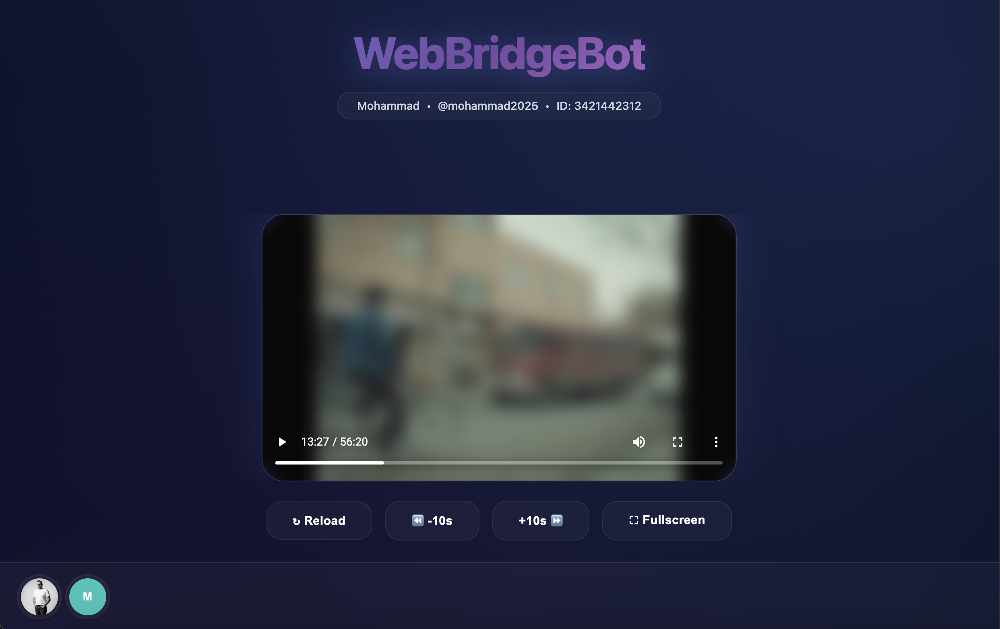
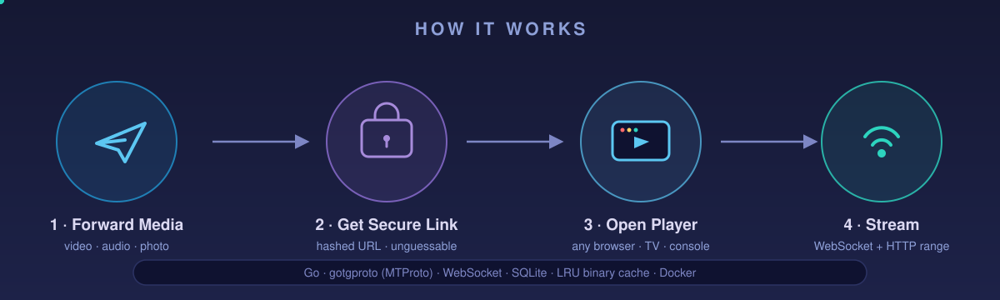

<p align="center">
  
</p>

<p align="center">
  <a href="https://golang.org/"></a>
  <a href="https://www.docker.com/"></a>
  
  
  
  <a href="LICENSE"></a>
</p>

<p align="center">
  Forward any video, audio, or photo to a Telegram bot — get back a private, unguessable link<br>
  that streams it in a beautiful web player on <b>any device</b>: TVs, game consoles, phones, browsers.
</p>

<p align="center">
  
</p>

---

## 📖 Table of Contents

- [How It Works](#-how-it-works) · [Features](#-features) · [Quick Start](#-quick-start) · [Environment Variables](#%EF%B8%8F-environment-variables) · [Admin & Access Control](#-admin--access-control) · [Debug & Troubleshooting](#-debug--troubleshooting) · [نسخه فارسی](#نسخه-فارسی)

---

## 🔀 How It Works

<p align="center">
  
</p>

1. **Send Media** — forward or upload a video, audio, or photo to the bot in a private chat.
2. **Generate Link** — the bot processes the file, generates a unique hash-based URL, and replies with an inline control panel.
3. **Open Player** — open the URL in any browser. The page connects back to the bot over WebSocket.
4. **Play Media** — media metadata arrives via WebSocket, then the file streams directly from the bot's server with full seeking support.

---

## ✨ Features

#### 🎬 Media & Streaming

- **Universal media support** — stream videos, audio, and photos from any chat or channel
- **HTTP Range requests** — smooth seeking in videos and audio
- **Intelligent binary cache** — LRU disk cache for frequently accessed chunks and instant replay
- **Audio visualization** — real-time spectrum analyzer (AudioMotion) for an immersive experience

#### ⚡ Real-Time Communication

- **WebSocket integration** — instant bidirectional link between bot and web player
- **Remote control** — play/pause, seek ±10s, restart, and fullscreen from Telegram's inline buttons
- **Live status updates** — connection state and playback status in real time

#### 🔒 Security & Access Control

- **Hash-based secure URLs** — media links cannot be guessed or shared
- **Robust authorization** — the first user becomes admin; everyone else must be approved
- **Session persistence** — SQLite-backed sessions with graceful shutdown handling

#### 🎨 Modern Web Interface

- **Gorgeous dark theme** — glassmorphism design with gradient accents and smooth animations
- **Fully responsive** — desktops, tablets, smartphones, smart TVs, and game consoles
- **Profile avatars & recent-users bar** — Telegram profile photos and quick session switching
- **Accessible** — keyboard navigation, ARIA labels, and reduced-motion support

---

## 🚀 Quick Start

> **Prerequisites:** Docker & Docker Compose · Telegram `API ID` + `API Hash` from [my.telegram.org](https://my.telegram.org/) · a Bot Token from [@BotFather](https://t.me/BotFather)

**1. Clone the repository**

```bash
git clone https://github.com/mshafiee/webbridgebot.git
cd webbridgebot
```

**2. Create a `.env` file**

```plaintext
# .env - Telegram API Configuration
API_ID=1234567
API_HASH=a1b2c3d4e5f6a1b2c3d4e5f6a1b2c3d4
BOT_TOKEN=1234567890:ABC-DEF1234ghIkl-zyx57W2v1u123ew11

# Web Server and URL Configuration
# Replace localhost with your server's IP or domain name if publicly accessible
BASE_URL=http://localhost:8080
PORT=8080

# (Optional) Cache Configuration
HASH_LENGTH=8
MAX_CACHE_SIZE=10737418240

# (Optional) Surveillance Channel — see Environment Variables below
LOG_CHANNEL_ID=0
```

**3. Run with Docker Compose**

```bash
docker-compose up -d
```

| | |
|---|---|
| 📜 **View logs** | `docker-compose logs -f` |
| 🛑 **Stop the bot** | `docker-compose down` |

> 💡 Prefer building from source? You'll need Go 1.21+ — see the `Makefile` for build targets.

<p align="center"></p>
---

## ⚙️ Environment Variables

| Variable | Description | Default | Required |
|---|---|---|---|
| `API_ID` | Your Telegram API ID from [my.telegram.org](https://my.telegram.org/) | — | **Yes** |
| `API_HASH` | Your Telegram API Hash | — | **Yes** |
| `BOT_TOKEN` | Your Telegram bot token from [@BotFather](https://t.me/BotFather) | — | **Yes** |
| `BASE_URL` | Public URL where the bot's web player is hosted | `http://localhost:8080` | **Yes** |
| `PORT` | Port the web server runs on | `8080` | No |
| `HASH_LENGTH` | Length of the short hash used in media URLs | `8` | No |
| `MAX_CACHE_SIZE` | Maximum disk cache size in bytes | `10737418240` (10 GB) | No |
| `CACHE_DIRECTORY` | Directory for cached media chunks and the database | `.cache` | No |
| `DEBUG_MODE` | Set to `true` to enable verbose logging | `false` | No |
| `LOG_CHANNEL_ID` | Optional channel to forward all media for auditing. The bot must be an admin there. For public channels use `@channel_username`; for private channels use the numeric ID (e.g. `-1001234567890`, findable via [@userinfobot](https://t.me/userinfobot)) | `0` (disabled) | No |

---

## 🔑 Admin & Access Control

The first user to send `/start` automatically becomes an **admin**. All other users must be approved before they can use the bot — unauthorized users are prompted to request access, and admins receive a notification with one-click approval buttons.

| Command | Action |
|---|---|
| `/authorize <user_id>` | Authorize a user |
| `/authorize <user_id> admin` | Authorize a user and grant admin rights |
| `/deauthorize <user_id>` | Revoke a user's access |
| `/listusers` | Paginated list of all users and their status |
| `/userinfo <user_id>` | Detailed information for a specific user |

> 🎥 **Media surveillance (optional):** set `LOG_CHANNEL_ID` to forward all media to a private log channel with user attribution.

---

## 🐛 Debug & Troubleshooting

Set `DEBUG_MODE=true` in your `.env` to enable verbose logging, then view it:

```bash
# With Docker Compose
docker-compose logs -f | grep DEBUG

# Direct execution
./webbridgebot | grep DEBUG
```

Debug logs include received messages, forwarded-message detection, media processing (file, size, MIME, duration), permission checks, file URL generation, WebSocket connections, HTTP streaming, log-channel forwarding, and callback queries.

**Common issues:**

- **Check environment variables** — ensure `API_ID`, `API_HASH`, `BOT_TOKEN`, and `BASE_URL` are set correctly in `.env`
- **Review logs** — `docker-compose logs -f` shows errors during startup and operation
- **Permissions** — make sure the `.cache` directory has correct write permissions
- **Log channel forwarding fails** — ensure `LOG_CHANNEL_ID` is correct and the bot is an admin in that channel
- **Forwarded messages not working** — enable debug logs and check forwarded-message detection and file extraction

---

## 🤝 Contributing

Contributions are welcome! Fork the repository, create a branch for your feature or bug fix, and submit a pull request with a clear description of your changes. Check the [issues](https://github.com/mshafiee/webbridgebot/issues) page for ideas on how to help.

## 📄 License

WebBridgeBot is released under the **GNU General Public License v3.0**. See the [LICENSE](LICENSE) file for details.

<p align="center"></p>

## نسخه فارسی (Persian Version)

<p align="center">
  
</p>

<p align="center">
  هر ویدیو، فایل صوتی یا تصویری را به ربات تلگرام فوروارد کنید و بلافاصله یک لینک خصوصی و غیرقابل حدس بگیرید<br>
  که آن را در یک پخش‌کننده وب زیبا روی <b>هر دستگاهی</b> پخش می‌کند: تلویزیون، کنسول بازی، موبایل، مرورگر.
</p>

<p align="center">
  
</p>

---

### 🔀 نحوه کار

<p align="center">
  
</p>

1. **ارسال رسانه** — ویدیو، صوت یا عکس را در چت خصوصی به ربات ارسال یا فوروارد کنید.
2. **ایجاد لینک** — ربات فایل را پردازش کرده، یک URL امن مبتنی بر هش تولید می‌کند و آن را همراه پنل کنترل ارسال می‌کند.
3. **باز کردن پخش‌کننده** — URL را در هر مرورگری باز کنید. صفحه وب از طریق وب‌سوکت به ربات متصل می‌شود.
4. **پخش رسانه** — اطلاعات رسانه از طریق وب‌سوکت دریافت می‌شود و سپس محتوای فایل مستقیماً از سرور ربات استریم می‌شود.
### ✨ ویژگی‌ها

#### 🎬 رسانه و استریمینگ

- **پشتیبانی جامع از رسانه** — پخش مستقیم ویدیو، صوت و تصویر از هر چت یا کانال
- **درخواست‌های محدوده HTTP** — جابجایی روان در ویدیوها و صوت‌ها
- **کش باینری هوشمند** — کش دیسک مبتنی بر LRU برای تکه‌های پرکاربرد و پخش فوری
- **ویژوالایزر صوتی** — آنالایزر طیف صوتی لحظه‌ای (AudioMotion) برای تجربه‌ای غرق‌کننده

#### ⚡ ارتباط لحظه‌ای

- **یکپارچگی وب‌سوکت** — ارتباط دوطرفه فوری بین ربات تلگرام و پخش‌کننده وب
- **کنترل از راه دور** — پخش/توقف، جابجایی ±۱۰ ثانیه، شروع مجدد و تمام‌صفحه از دکمه‌های درون‌خطی تلگرام
- **به‌روزرسانی وضعیت زنده** — نمایش لحظه‌ای وضعیت اتصال و حالت پخش

#### 🔒 امنیت و کنترل دسترسی

- **URL امن مبتنی بر هش** — لینک‌های رسانه قابل حدس زدن یا اشتراک‌گذاری نیستند
- **مجوزدهی قوی** — اولین کاربر ادمین می‌شود؛ بقیه کاربران باید توسط ادمین تأیید شوند
- **ماندگاری نشست** — نشست‌های امن مبتنی بر SQLite با مدیریت خاموش شدن ایمن

#### 🎨 رابط وب مدرن

- **تم تاریک زیبا** — طراحی گلس‌مورفیسم با لهجه‌های گرادیانت و انیمیشن‌های روان
- **کاملاً واکنش‌گرا** — دسکتاپ، تبلت، گوشی هوشمند، تلویزیون هوشمند و کنسول بازی
- **آواتار پروفایل و نوار کاربران اخیر** — عکس پروفایل تلگرام و جابجایی سریع بین نشست‌ها
- **دسترس‌پذیری** — ناوبری کامل صفحه‌کلید، برچسب‌های ARIA و پشتیبانی از حرکت کاهش‌یافته

### 🚀 راه‌اندازی سریع

> **پیش‌نیازها:** Docker و Docker Compose · `API ID` و `API Hash` تلگرام از [my.telegram.org](https://my.telegram.org/) · توکن ربات از [@BotFather](https://t.me/BotFather)

**۱. کلون مخزن**

```bash
git clone https://github.com/mshafiee/webbridgebot.git
cd webbridgebot
```

**۲. ساخت فایل `.env`**

```plaintext
# .env - تنظیمات API تلگرام
API_ID=1234567
API_HASH=a1b2c3d4e5f6a1b2c3d4e5f6a1b2c3d4
BOT_TOKEN=1234567890:ABC-DEF1234ghIkl-zyx57W2v1u123ew11

# تنظیمات وب‌سرور و URL
# اگر عمومی است، localhost را با IP یا دامنه سرور خود جایگزین کنید
BASE_URL=http://localhost:8080
PORT=8080

# (اختیاری) تنظیمات کش
HASH_LENGTH=8
MAX_CACHE_SIZE=10737418240

# (اختیاری) کانال نظارت — جدول متغیرهای محیطی را ببینید
LOG_CHANNEL_ID=0
```

**۳. اجرا با Docker Compose**

```bash
docker-compose up -d
```

| | |
|---|---|
| 📜 **مشاهده لاگ‌ها** | `docker-compose logs -f` |
| 🛑 **توقف ربات** | `docker-compose down` |

> 💡 اگر می‌خواهید از سورس بیلد بگیرید، به Go نسخه 1.21+ نیاز دارید — تارگت‌های بیلد را در `Makefile` ببینید.

<p align="center"></p>
### ⚙️ متغیرهای محیطی

| متغیر | توضیح | پیش‌فرض | الزامی |
|---|---|---|---|
| `API_ID` | شناسه API تلگرام شما از [my.telegram.org](https://my.telegram.org/) | — | **بله** |
| `API_HASH` | API Hash تلگرام شما | — | **بله** |
| `BOT_TOKEN` | توکن ربات تلگرام شما از [@BotFather](https://t.me/BotFather) | — | **بله** |
| `BASE_URL` | URL عمومی که پخش‌کننده وب ربات در آن میزبانی می‌شود | `http://localhost:8080` | **بله** |
| `PORT` | پورتی که سرور وب روی آن اجرا می‌شود | `8080` | خیر |
| `HASH_LENGTH` | طول هش کوتاه استفاده‌شده در URLهای رسانه | `8` | خیر |
| `MAX_CACHE_SIZE` | حداکثر حجم کش دیسک به بایت | `10737418240` (10GB) | خیر |
| `CACHE_DIRECTORY` | دایرکتوری ذخیره تکه‌های رسانه کش‌شده و پایگاه داده | `.cache` | خیر |
| `DEBUG_MODE` | برای فعال کردن لاگ کامل، `true` تنظیم کنید | `false` | خیر |
| `LOG_CHANNEL_ID` | کانال اختیاری برای فوروارد تمام رسانه‌ها جهت ثبت. ربات باید ادمین آن کانال باشد. برای کانال‌های عمومی `@channel_username` و برای کانال‌های خصوصی شناسه عددی (مثل `-1001234567890`، قابل دریافت از [@userinfobot](https://t.me/userinfobot)) | `0` (غیرفعال) | خیر |

### 🔑 مدیریت کاربران و ادمین

اولین کاربری که دستور `/start` را ارسال کند به طور خودکار **ادمین** می‌شود. بقیه کاربران باید قبل از استفاده از ربات تأیید شوند — کاربران غیرمجاز پیام درخواست دسترسی می‌بینند و ادمین‌ها اعلان تأیید یک‌کلیکی دریافت می‌کنند.

| دستور | عملکرد |
|---|---|
| `/authorize <user_id>` | مجاز کردن یک کاربر |
| `/authorize <user_id> admin` | مجاز کردن کاربر و اعطای حق ادمین |
| `/deauthorize <user_id>` | لغو دسترسی یک کاربر |
| `/listusers` | لیست صفحه‌بندی‌شده تمام کاربران و وضعیت آن‌ها |
| `/userinfo <user_id>` | اطلاعات دقیق یک کاربر خاص |

> 🎥 **نظارت رسانه (اختیاری):** با تنظیم `LOG_CHANNEL_ID` تمام رسانه‌ها با نسبت‌دادن کاربر به یک کانال لاگ خصوصی فوروارد می‌شوند.

### 🐛 حالت دیباگ و عیب‌یابی

`DEBUG_MODE=true` را در فایل `.env` تنظیم کنید تا لاگ کامل فعال شود، سپس آن را مشاهده کنید:

```bash
# با داکر کامپوز
docker-compose logs -f | grep DEBUG

# اجرای مستقیم
./webbridgebot | grep DEBUG
```

لاگ‌های دیباگ شامل پیام‌های دریافتی، تشخیص پیام‌های فورواردشده، پردازش رسانه (فایل، حجم، MIME، مدت زمان)، بررسی مجوزها، تولید URL فایل، اتصالات وب‌سوکت، استریمینگ HTTP، فوروارد به کانال لاگ و کوئری‌های کال‌بک است.

**مشکلات رایج:**

- **بررسی متغیرهای محیطی** — مطمئن شوید `API_ID`، `API_HASH`، `BOT_TOKEN` و `BASE_URL` به‌درستی در `.env` تنظیم شده‌اند
- **بررسی لاگ‌ها** — `docker-compose logs -f` خطاهای راه‌اندازی و عملکرد را نشان می‌دهد
- **مجوزها** — مطمئن شوید دایرکتوری `.cache` مجوز نوشتن صحیح دارد
- **خطا در فوروارد به کانال لاگ** — مطمئن شوید `LOG_CHANNEL_ID` صحیح است و ربات ادمین آن کانال است
- **پیام‌های فورواردشده کار نمی‌کنند** — لاگ دیباگ را فعال کنید و تشخیص فوروارد و استخراج فایل را بررسی کنید

### 🤝 مشارکت

از مشارکت شما استقبال می‌کنیم! لطفاً مخزن را فورک کرده، یک شاخه برای ویژگی یا رفع اشکال خود ایجاد کنید و یک درخواست ادغام (pull request) با توضیحات واضح ارسال کنید. برای یافتن ایده‌های کمک، به بخش [issues](https://github.com/mshafiee/webbridgebot/issues) مراجعه کنید.

### 📄 مجوز

پروژه WebBridgeBot تحت **مجوز عمومی همگانی گنو نسخه ۳.۰ (GNU General Public License v3.0)** منتشر شده است. برای جزئیات بیشتر به فایل [LICENSE](LICENSE) مراجعه کنید.

<p align="center"></p>

<p align="center">
  <b>WebBridgeBot</b> — Your Telegram media, streamed anywhere.<br>
  رسانه تلگرام شما، پخش‌شده در هر کجا.
</p>
